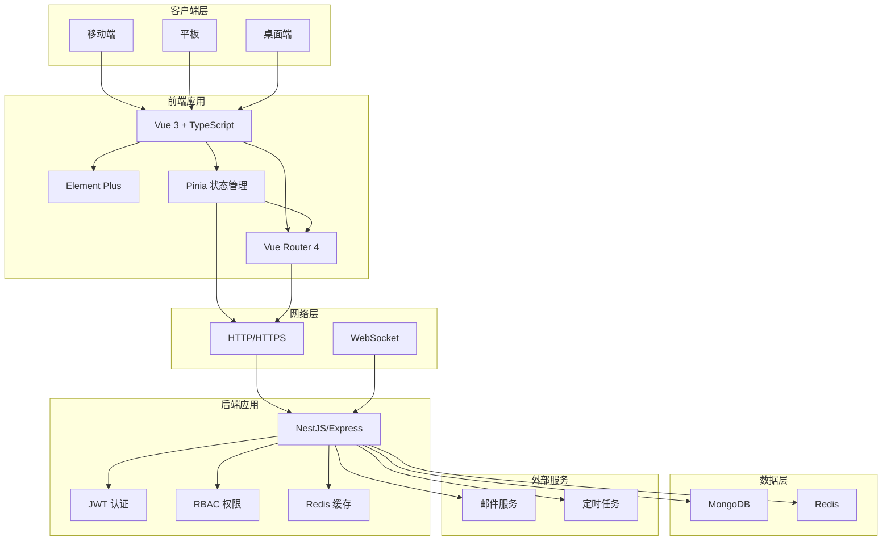
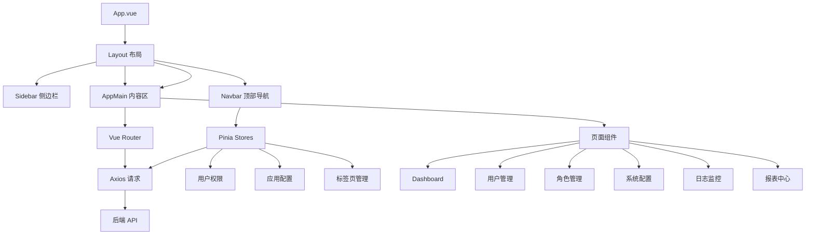
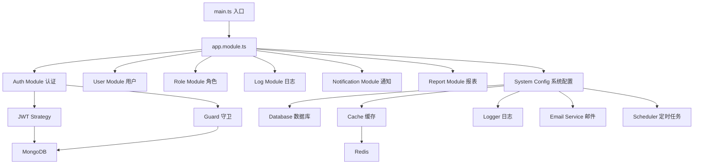

# 后台管理系统技术设计文档

Feature Name: admin-system
Updated: 2026-02-06

## 描述

本系统是一个完整的企业级后台管理系统，采用前后端分离架构，支持用户权限管理、数据可视化、操作日志监控、消息通知和报表生成等核心功能。系统具备响应式设计，支持移动端、平板和桌面三端访问。

## 架构

### 系统架构



### 前端架构



### 后端架构



## 组件和接口

### 前端核心组件

#### 1. 布局组件

**Sidebar（侧边栏）**
- **文件位置**: `src/layout/components/Sidebar/index.vue`
- **功能**: 根据用户权限动态渲染菜单，支持折叠和展开
- **Props**: `collapsed: boolean`
- **依赖**: `el-menu`, `el-sub-menu`, `el-menu-item`

**Navbar（顶部导航）**
- **文件位置**: `src/layout/components/Navbar/index.vue`
- **功能**: 显示用户信息、退出登录、全屏切换、主题切换
- **方法**: `logout()`, `toggleFullScreen()`, `toggleTheme()`

**TagsView（标签页）**
- **文件位置**: `src/layout/components/TagsView/index.vue`
- **功能**: 管理已访问的页面，支持右键菜单（关闭其他、关闭左侧等）
- **依赖**: `tagsView` store

#### 2. 业务组件

**UserTable（用户表格）**
- **文件位置**: `src/components/table/UserTable.vue`
- **功能**: 用户列表展示、分页、排序、筛选、批量操作
- **Props**: `loading: boolean`, `data: User[]`
- **方法**: `handleEdit()`, `handleDelete()`, `handleBatchDelete()`

**RoleTree（角色权限树）**
- **文件位置**: `src/components/form/RoleTree.vue`
- **功能**: 树形权限选择器
- **依赖**: `el-tree`

**EChartsCard（图表卡片）**
- **文件位置**: `src/components/echarts/EChartsCard.vue`
- **功能**: 封装 ECharts 图表，支持响应式
- **Props**: `type: 'line' | 'bar' | 'pie' | 'gauge'`, `data: any`

### 后端核心模块

#### 1. 认证模块（Auth Module）

**接口定义**

```typescript
// 登录
POST /auth/login
Request: { username: string, password: string, captcha?: string }
Response: { accessToken: string, refreshToken: string, expiresIn: number }

// 登出
POST /auth/logout
Headers: Authorization: Bearer <token>
Response: { success: boolean }

// 刷新Token
POST /auth/refresh-token
Request: { refreshToken: string }
Response: { accessToken: string, expiresIn: number }

// 发送验证码
POST /auth/send-sms-code
Request: { email: string }
Response: { success: boolean, expires: number }
```

**核心服务**

- `AuthService`: 处理登录、登出、Token验证
- `JwtStrategy`: JWT 策略，用于 Passport 认证
- `JwtAuthGuard`: JWT 认证守卫

#### 2. 用户模块（User Module）

**接口定义**

```typescript
// 用户列表
GET /users?page=1&pageSize=10&keyword=&status=
Response: { total: number, items: User[] }

// 用户详情
GET /users/:id
Response: User

// 新增用户
POST /users
Request: { username: string, email: string, password: string, roles: string[] }
Response: User

// 编辑用户
PUT /users/:id
Request: Partial<User>
Response: User

// 删除用户
DELETE /users/:id
Response: { success: boolean }

// 批量删除
DELETE /users/batch
Request: { ids: string[] }
Response: { success: boolean, count: number }
```

**核心服务**

- `UserService`: 用户CRUD操作
- `UserGuard`: 用户权限守卫

#### 3. 角色模块（Role Module）

**接口定义**

```typescript
// 角色列表
GET /roles
Response: Role[]

// 角色详情
GET /roles/:id
Response: Role

// 新增角色
POST /roles
Request: { name: string, code: string, description: string, permissions: string[] }
Response: Role

// 分配权限
PUT /roles/:id/permissions
Request: { permissions: string[] }
Response: Role
```

**核心服务**

- `RoleService`: 角色管理
- `PermissionService`: 权限管理

#### 4. 日志模块（Log Module）

**接口定义**

```typescript
// 操作日志
GET /logs/oper?page=1&pageSize=10&userId=&startTime=&endTime=
Response: { total: number, items: OperLog[] }

// 登录日志
GET /logs/login?page=1&pageSize=10&userId=&ip=
Response: { total: number, items: LoginLog[] }

// 清理日志
DELETE /logs/cleanup?days=30
Response: { success: boolean, deleted: number }
```

**核心服务**

- `OperLogService`: 操作日志服务
- `LoginLogService`: 登录日志服务

#### 5. 通知模块（Notification Module）

**接口定义**

```typescript
// 消息列表
GET /notifications?page=1&pageSize=10&read=&type=
Response: { total: number, items: Message[], unread: number }

// 标记已读
PUT /notifications/:id/read
Response: { success: boolean }

// 发送测试邮件
POST /notifications/test-email
Request: { to: string }
Response: { success: boolean }

// 保存设置
PUT /notifications/settings
Request: NotificationSettings
Response: NotificationSettings
```

**核心服务**

- `NotificationService`: 通知管理
- `EmailService`: 邮件发送服务

#### 6. 报表模块（Report Module）

**接口定义**

```typescript
// 统计数据
GET /reports/stats
Response: DashboardStats

// 趋势数据
GET /reports/trend?days=30
Response: TrendData[]

// 导出报告
GET /reports/export?type=daily&date=2026-02-06
Response: PDF/Excel file

// 订阅配置
GET /reports/subscription
Response: ReportSubscription

POST /reports/subscription
Request: ReportSubscription
Response: ReportSubscription
```

**核心服务**

- `ReportService`: 报表生成
- `ReportScheduler`: 定时报表任务

## 数据模型

### MongoDB 数据模型

#### User（用户）

```typescript
{
  _id: ObjectId
  username: string        // 用户名（唯一）
  email: string           // 邮箱（唯一）
  phone?: string          // 手机号
  password: string        // 加密后的密码
  avatar?: string         // 头像URL
  status: 'active' | 'disabled' | 'locked'  // 状态
  roles: string[]         // 角色ID数组
  lastLoginAt?: Date      // 最后登录时间
  lastLoginIp?: string    // 最后登录IP
  createdAt: Date
  updatedAt: Date
}

索引:
- username: unique
- email: unique
- phone: index
- roles: index
```

#### Role（角色）

```typescript
{
  _id: ObjectId
  name: string            // 角色名称
  code: string            // 角色代码（唯一）
  description?: string    // 描述
  permissions: string[]   // 权限代码数组
  status: 'active' | 'disabled'
  createdAt: Date
  updatedAt: Date
}

索引:
- code: unique
```

#### Permission（权限）

```typescript
{
  _id: ObjectId
  name: string            // 权限名称
  code: string            // 权限代码（唯一）
  type: 'menu' | 'button' | 'api'  // 权限类型
  path?: string           // 路由路径（menu类型）
  icon?: string           // 图标
  parentId?: ObjectId     // 父级权限
  sort: number            // 排序
  createdAt: Date
  updatedAt: Date
}

索引:
- code: unique
- parentId: index
```

#### OperLog（操作日志）

```typescript
{
  _id: ObjectId
  userId: ObjectId        // 用户ID
  username: string        // 用户名
  module: string          // 模块名称
  action: string          // 操作类型
  method: string          // HTTP方法
  path: string           // 请求路径
  params?: any            // 请求参数
  result?: any            // 响应结果
  ip: string              // IP地址
  duration: number        // 耗时（ms）
  status: 'success' | 'failed'
  createdAt: Date
}

索引:
- userId + createdAt: compound
- username + createdAt: compound
```

#### LoginLog（登录日志）

```typescript
{
  _id: ObjectId
  userId: ObjectId        // 用户ID
  username: string        // 用户名
  ip: string              // IP地址
  location?: string       // 地理位置
  device?: string         // 设备信息
  browser?: string        // 浏览器
  os?: string             // 操作系统
  status: 'success' | 'failed'
  reason?: string         // 失败原因
  createdAt: Date
}

索引:
- userId + createdAt: compound
- ip + createdAt: compound
```

#### Message（消息）

```typescript
{
  _id: ObjectId
  userId: ObjectId        // 接收用户ID
  type: 'system' | 'alert' | 'report'  // 消息类型
  title: string           // 标题
  content: string         // 内容
  read: boolean           // 是否已读
  source: string          // 来源
  link?: string           // 跳转链接
  createdAt: Date
}

索引:
- userId + read + createdAt: compound
```

#### SystemConfig（系统配置）

```typescript
{
  _id: ObjectId
  key: string             // 配置键（唯一）
  value: any              // 配置值
  description?: string    // 描述
  updatedAt: Date
}

索引:
- key: unique
```

#### NotificationSetting（通知设置）

```typescript
{
  _id: ObjectId
  userId: ObjectId        // 用户ID
  type: string            // 通知类型
  config: {
    enabled: boolean      // 是否启用
    email?: string        // 邮箱地址
    silentHours?: {      // 静默时段
      start: string      // 开始时间
      end: string        // 结束时间
    }
  }
  createdAt: Date
  updatedAt: Date
}

索引:
- userId + type: compound unique
```

#### ReportSubscription（报告订阅）

```typescript
{
  _id: ObjectId
  userId: ObjectId        // 用户ID
  type: 'daily' | 'weekly' | 'monthly'  // 报告类型
  content: string[]      // 订阅内容
  recipients: string[]   // 接收人邮箱
  createdAt: Date
  updatedAt: Date
}

索引:
- userId + type: compound unique
```

### Redis 缓存结构

```
用户会话:
user:session:{userId} -> { accessToken, refreshToken, expires }

权限缓存:
user:permissions:{userId} -> { permissions: [], roles: [] }

系统配置缓存:
system:config -> { key-value 对象 }

验证码缓存:
email:code:{email} -> { code, expires, attempts }

数据缓存:
stats:dashboard -> { 统计数据 }
stats:trend:{days} -> { 趋势数据 }
```

## 正确性属性

### 1. 认证授权

- **令牌唯一性**: 每个 JWT Token 都是唯一的，包含用户ID和过期时间
- **权限一致性**: 用户权限变更后，Token刷新时立即生效
- **会话管理**: 用户登出后，Token立即失效（通过Token黑名单）

### 2. 数据完整性

- **用户密码**: 使用 bcrypt 加密，盐值随机生成
- **软删除**: 删除用户时仅标记状态，不物理删除数据
- **审计追踪**: 所有关键操作都有日志记录

### 3. 并发控制

- **乐观锁**: 编辑用户和角色时使用版本号防止冲突
- **分布式锁**: 定时任务使用Redis分布式锁防止重复执行

### 4. 幂等性

- **验证码发送**: 同一邮箱1分钟内只能发送一次验证码
- **登录失败**: 同一账户连续5次失败后锁定30分钟

## 错误处理

### 错误码定义

| 错误码 | 说明 | HTTP状态码 |
|--------|------|-----------|
| AUTH_INVALID_CREDENTIALS | 用户名或密码错误 | 401 |
| AUTH_TOKEN_EXPIRED | Token已过期 | 401 |
| AUTH_TOKEN_INVALID | Token无效 | 401 |
| USER_NOT_FOUND | 用户不存在 | 404 |
| USER_ALREADY_EXISTS | 用户已存在 | 409 |
| USER_LOCKED | 用户已锁定 | 403 |
| PERMISSION_DENIED | 权限不足 | 403 |
| VALIDATION_ERROR | 参数验证失败 | 400 |
| INTERNAL_ERROR | 服务器内部错误 | 500 |

### 错误处理策略

**全局异常过滤器（Global Exception Filter）**

```typescript
@Catch()
export class AllExceptionsFilter implements ExceptionFilter {
  catch(exception: unknown, host: ArgumentsHost) {
    const ctx = host.switchToHttp()
    const response = ctx.getResponse<Response>()
    const request = ctx.getRequest<Request>()

    const status = exception instanceof HttpException
      ? exception.getStatus()
      : HttpStatus.INTERNAL_SERVER_ERROR

    const message = exception instanceof HttpException
      ? exception.message
      : 'Internal server error'

    // 记录错误日志
    this.logger.error(
      `${request.method} ${request.url}`,
      exception instanceof Error ? exception.stack : exception
    )

    response.status(status).json({
      success: false,
      statusCode: status,
      message,
      timestamp: new Date().toISOString(),
      path: request.url,
    })
  }
}
```

**前端错误处理**

- **HTTP拦截器**: 统一处理401、403等错误
- **全局错误提示**: 使用 Element Plus ElMessage 组件
- **错误边界**: 捕获组件渲染错误

### 重试机制

- **邮件发送失败**: 自动重试最多3次，间隔5秒
- **API请求失败**: 网络错误自动重试1次

## 测试策略

### 前端测试

#### 单元测试
- **测试框架**: Vitest
- **覆盖范围**:
  - Utils 工具函数（100%）
  - Hooks 组合式函数（80%）
  - 核心组件逻辑（70%）

#### 集成测试
- **测试框架**: Vue Test Utils
- **覆盖范围**:
  - 路由守卫
  - 状态管理（Pinia stores）
  - API请求

#### E2E测试
- **测试框架**: Playwright
- **测试场景**:
  - 用户登录/登出
  - 用户CRUD操作
  - 角色权限分配

### 后端测试

#### 单元测试
- **测试框架**: Jest
- **覆盖范围**:
  - Services 业务逻辑（90%）
  - Guards 守卫（80%）
  - Utils 工具函数（100%）

#### 集成测试
- **测试工具**: Supertest
- **覆盖范围**:
  - API端点测试
  - 数据库操作
  - 缓存操作

#### 压力测试
- **测试工具**: Artillery
- **测试指标**:
  - 并发用户数
  - 响应时间
  - 错误率

### 测试数据

使用 Docker Compose 启动测试环境：
- MongoDB 测试实例
- Redis 测试实例
- 邮件服务 Mock（Mailhog）

## 部署架构

### 开发环境

```yaml
services:
  frontend:
    build: ./frontend
    ports: ["3000:3000"]
    environment:
      - VITE_API_URL=http://localhost:4000

  backend:
    build: ./backend
    ports: ["4000:4000"]
    environment:
      - DATABASE_URL=mongodb://mongo:27017/admin
      - REDIS_URL=redis://redis:6379
    depends_on:
      - mongo
      - redis

  mongo:
    image: mongo:6.0
    ports: ["27017:27017"]
    volumes:
      - mongo-data:/data/db

  redis:
    image: redis:7.0
    ports: ["6379:6379"]
```

### 生产环境

- **前端**: Nginx + Docker
- **后端**: PM2 + Docker
- **数据库**: MongoDB Replica Set
- **缓存**: Redis Cluster
- **反向代理**: Nginx
- **SSL证书**: Let's Encrypt

## 安全考虑

### 1. 输入验证
- 所有API请求使用 DTO（Data Transfer Object）进行验证
- 使用 class-validator 进行声明式验证
- 防止SQL注入、XSS攻击

### 2. 数据加密
- 密码使用 bcrypt 加密（salt rounds: 10）
- 敏感配置使用环境变量存储
- Token使用 JWT 签名

### 3. 速率限制
- 使用 Redis 实现接口限流
- 登录接口：5次/分钟
- 验证码接口：1次/分钟
- 普通接口：100次/分钟

### 4. CORS配置
- 严格限制允许的源
- 只允许必要的HTTP方法
- 预检请求缓存时间合理

## 性能优化

### 前端优化
- **代码分割**: 使用路由懒加载
- **按需引入**: Element Plus 按需导入
- **虚拟滚动**: 长列表使用虚拟滚动
- **图片优化**: 使用 WebP 格式，懒加载

### 后端优化
- **数据库索引**: 为常用查询字段创建索引
- **缓存策略**: 热点数据使用Redis缓存
- **查询优化**: 使用分页，避免全表扫描
- **连接池**: 数据库连接池配置合理大小

### 缓存策略
- **用户信息**: 缓存1小时
- **权限信息**: 缓存30分钟
- **系统配置**: 缓存1天
- **统计数据**: 缓存5分钟

## 参考文档

[^1]: Vue 3 官方文档 - https://vuejs.org/
[^2]: NestJS 官方文档 - https://docs.nestjs.com/
[^3]: Element Plus 官方文档 - https://element-plus.org/
[^4]: MongoDB 官方文档 - https://docs.mongodb.com/
[^5]: JWT 规范 - https://tools.ietf.org/html/rfc7519
[^6]: ECharts 官方文档 - https://echarts.apache.org/
